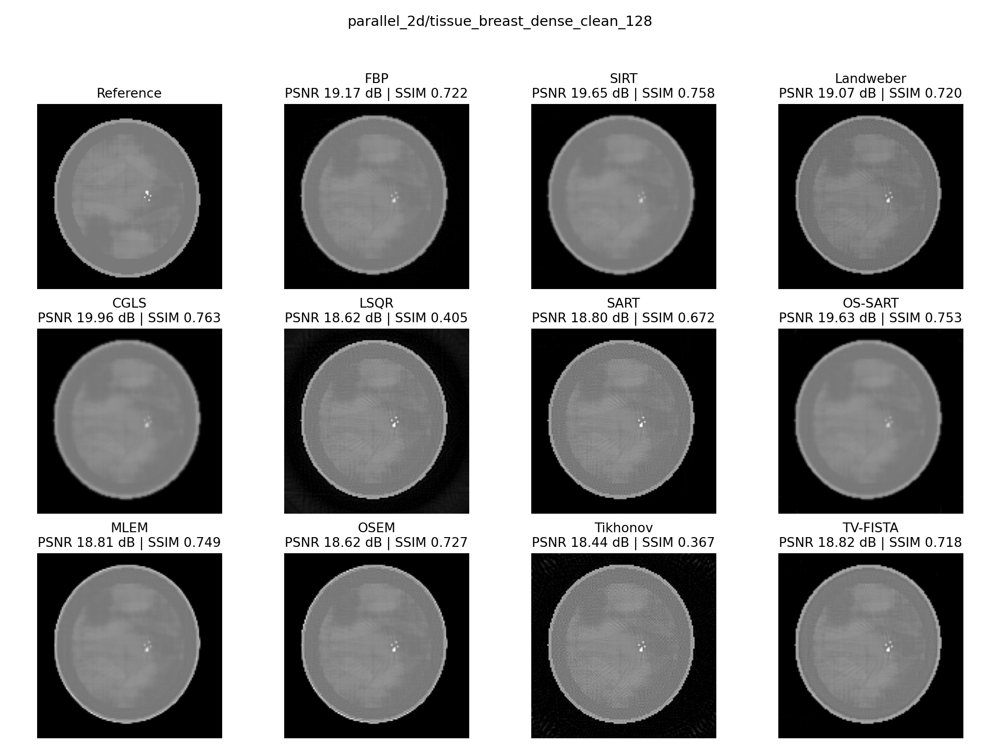
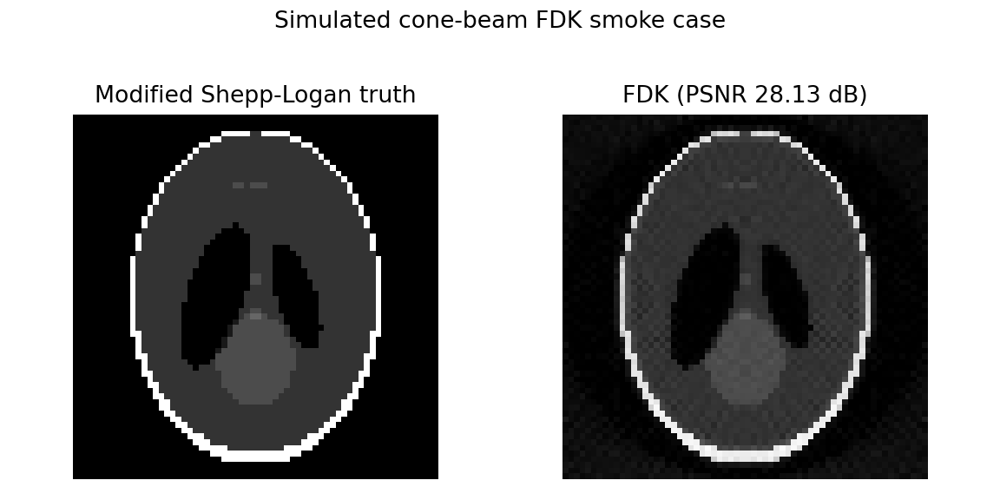

# inv_framework

`inv_framework` 是一个面向 X-ray CT 重建与评测的轻量 Python 框架。项目将 CT
前向算子、经典求解算法、版本化测试数据和评测协议组织为统一接口，并提供可安装的
`invct` 命令行工具，用于复现单次重建和批量 benchmark。

项目当前提供 12 个传统 CT solver、纯 PyTorch 2D parallel-beam Radon、ASTRA
3D/FDK 后端、统一质量指标，以及包含 tensor、图像、manifest 和 SHA256 的可审计产物。

## CT 是什么？

计算机断层成像（Computed Tomography, CT）从不同角度采集 X-ray 投影，再根据扫描
几何恢复物体内部的线性衰减系数。二维 parallel-beam CT 的测量通常称为 sinogram；
三维 cone-beam CT 的测量则由多角度二维投影组成。

CT 重建的核心困难包括有限角度、稀疏角度、测量噪声和大型三维数据。解析算法速度快，
迭代算法能够更灵活地加入约束与正则化，不同算法应当在相同数据、几何和指标协议下比较。

## 数学形式

离散 CT 前向模型写作：

```text
y = A x + n
```

- `x`：待重建的二维图像或三维体数据
- `A`：由扫描几何确定的正投影算子
- `y`：探测器测量
- `n`：高斯噪声、Poisson 光子噪声或其他误差

线性 CT 中，`A^T` 表示伴随算子。常见的正则化重建目标为：

```text
min_x  0.5 * ||A x - y||_2^2 + lambda * R(x)
```

CGLS 和 LSQR 直接处理线性最小二乘问题，SART 与 OSEM 使用投影子集，Tikhonov
使用二次正则，TV-FISTA 使用总变分正则，FBP 和 FDK 则属于解析或近似解析重建方法。

## 支持的算法

| CLI 名称 | 算法 | 维度与几何 | 主要配置 | 后端 |
| --- | --- | --- | --- | --- |
| `fbp` | Filtered Backprojection | 2D parallel | `scale` | PyTorch CPU/CUDA |
| `sirt` | SIRT | 2D parallel | `num_iterations`、上下界 | PyTorch CPU/CUDA |
| `landweber` | Landweber | 2D parallel | `num_iterations`、`step_size` | PyTorch CPU/CUDA |
| `cgls` | CGLS | 2D parallel | `num_iterations`、`tol` | PyTorch CPU/CUDA |
| `lsqr` | LSQR | 2D parallel | `num_iterations`、`damping` | PyTorch CPU/CUDA |
| `sart` | SART | 2D parallel | `block_size`、`relaxation` | PyTorch CPU/CUDA |
| `os_sart` | Ordered-subsets SART | 2D parallel | `subset_count`、`relaxation` | PyTorch CPU/CUDA |
| `mlem` | MLEM | 2D parallel | `num_iterations`、`initial_value` | PyTorch CPU/CUDA |
| `osem` | OSEM | 2D parallel | `subset_count`、`initial_value` | PyTorch CPU/CUDA |
| `tikhonov` | Tikhonov CG | 2D parallel | `reg_strength`、`tolerance` | PyTorch CPU/CUDA |
| `tv_fista` | TV-FISTA | 2D parallel | `reg_strength`、TV proximal 参数 | PyTorch CPU/CUDA |
| `fdk` | Feldkamp-Davis-Kress | 3D circular cone | short scan、voxel supersampling | ASTRA CUDA |

查看 registry 及每个 solver 的默认参数和能力要求：

```bash
invct list-solvers
invct list-solvers --json
```

运行前会检查 solver、参数类型、数据维度、扫描几何和后端能力。不兼容组合会明确失败，
不会被记录为成功运行。

## 安装

要求 Python 3.10 或更高版本。

```bash
git clone https://github.com/apricity093/agent_CT.git
cd agent_CT
python -m pip install -e .
```

安装后可以使用 `invct`，也可以通过 Python 模块入口执行同一套命令：

```bash
invct --help
python -m inv_framework --help
```

主要依赖由 `pyproject.toml` 声明，包括 PyTorch、NumPy、h5py、PyYAML 和
Matplotlib。开发环境可安装：

```bash
python -m pip install -e ".[dev]"
```

FDK 还需要安装带 CUDA 支持的 [ASTRA Toolbox](https://github.com/astra-toolbox/astra-toolbox)。

## 运行环境与 GPU

算法可以在 GPU 上运行。`fbp` 到 `tv_fista` 的 11 个二维算法都基于 PyTorch，
指定 `--device cuda` 后，case tensor、Radon operator 和 solver 计算都会位于 CUDA
设备。没有可用 GPU 时，这些二维算法可以改用 `--device cpu`。

README 中的单算法示例优先使用 CUDA

FDK 的能力边界不同：`fdk` 必须同时满足以下条件，不能回退到 CPU：

- 命令指定 `--device cuda`
- PyTorch CUDA 可用
- ASTRA 已安装且 `astra.use_cuda()` 为真
- case 使用受支持的 regular circular cone geometry 和 cubic voxels

## 准备和检查数据

仓库提供 JSON catalog、case manifest 和 HDF5 数组。可以先查询数据：

```bash
invct data list
invct data list --dimension 2
invct data list --geometry parallel_2d --tag quality
invct data list --json
```

查看单个 case：

```bash
invct data show parallel_2d/tissue_breast_dense_clean_128
```

校验 manifest、HDF5 shape 和 SHA256：

```bash
invct data validate
invct data validate parallel_2d/tissue_breast_dense_clean_128
```

默认数据根目录为仓库内的 `test/data`。使用外部 catalog 时可为数据命令或 `run`
显式传入 `--root PATH` / `--data-root PATH`。

每个 case 的 HDF5 数据使用统一键：

| 路径 | 含义 |
| --- | --- |
| `truth/x` | ground truth，shape 为 `(B, *domain_shape)` |
| `measurement/y_clean` | 无噪测量 |
| `measurement/y_observed` | 实际输入 solver 的测量 |
| `masks/roi` | 可选图像 ROI |
| `masks/valid_measurement` | 可选有效测量 mask |

## 运行单个算法

每个 solver使用各自的严格 YAML 配置；未知字段、错误类型和几何不兼容会在数值计算前失败。

### FBP

```bash
invct run fbp --case parallel_2d/tissue_breast_dense_clean_128 --config configs/algorithms/fbp.yaml --out artifacts/fbp_dense_cuda --device cuda
```

### SIRT

```bash
invct run sirt --case parallel_2d/tissue_breast_dense_clean_128 --config configs/algorithms/sirt.yaml --out artifacts/sirt_dense_cuda --device cuda
```

### Landweber

```bash
invct run landweber --case parallel_2d/tissue_breast_dense_clean_128 --config configs/algorithms/landweber.yaml --out artifacts/landweber_dense_cuda --device cuda
```

### CGLS

```bash
invct run cgls --case parallel_2d/tissue_breast_dense_clean_128 --config configs/algorithms/cgls.yaml --out artifacts/cgls_dense_cuda --device cuda
```

### LSQR

```bash
invct run lsqr --case parallel_2d/tissue_breast_dense_clean_128 --config configs/algorithms/lsqr.yaml --out artifacts/lsqr_dense_cuda --device cuda
```

### SART

```bash
invct run sart --case parallel_2d/tissue_breast_dense_clean_128 --config configs/algorithms/sart.yaml --out artifacts/sart_dense_cuda --device cuda
```

### OS-SART

```bash
invct run os_sart --case parallel_2d/tissue_breast_dense_clean_128 --config configs/algorithms/os_sart.yaml --out artifacts/os_sart_dense_cuda --device cuda
```

### MLEM

```bash
invct run mlem --case parallel_2d/tissue_breast_dense_clean_128 --config configs/algorithms/mlem.yaml --out artifacts/mlem_dense_cuda --device cuda
```

### OSEM

```bash
invct run osem --case parallel_2d/tissue_breast_dense_clean_128 --config configs/algorithms/osem.yaml --out artifacts/osem_dense_cuda --device cuda
```

### Tikhonov

```bash
invct run tikhonov --case parallel_2d/tissue_breast_dense_clean_128 --config configs/algorithms/tikhonov.yaml --out artifacts/tikhonov_dense_cuda --device cuda
```

### TV-FISTA

```bash
invct run tv_fista --case parallel_2d/tissue_breast_dense_clean_128 --config configs/algorithms/tv_fista.yaml --out artifacts/tv_fista_dense_cuda --device cuda
```

### FDK

FDK 使用单独的 3D cone-beam case，并要求 ASTRA CUDA：

```bash
invct run fdk --case cone_3d/spheres_astra_12 --config configs/algorithms/fdk.yaml --out artifacts/fdk_cone_cuda --device cuda
```

输出目录非空时默认拒绝运行，以防旧结果与新 manifest 混合。确认替换该次 run 产物时，
在相应命令末尾显式加入 `--overwrite`。

## 离线评估

`eval` 直接读取 run 保存的 tensor bundle，重新计算指标，不会重新运行 solver，也不
依赖当前机器上的 projector 或 ASTRA：

```bash
invct eval --run artifacts/fbp_dense_cuda --protocol /path/to/single_run_protocol.yaml
```

单次评估 protocol 可以写为：

```yaml
schema_version: 1
name: single_run
expected_statuses: [success]
min_records: 1
required_metrics: [relative_error, rmse, psnr, ssim, data_residual, runtime_seconds]
thresholds:
  psnr: {min: 15.0}
  ssim: {min: 0.5}
  data_residual: {max: 1.0}
```

protocol 使用显式 `{min: ...}` 或 `{max: ...}` 声明阈值方向。评估会生成
`evaluation.json` 与中文 `evaluation.md` 报告。统一指标包括：

- relative error
- RMSE
- PSNR
- SSIM
- data residual
- runtime

二维 case 使用 2D SSIM；3D FDK 使用所有 axial slices 的平均 SSIM。

## 运行 benchmark

suite 使用 group 表达“算法配置列表 x case 列表”，因此 11 个二维算法和 FDK 可以
分别使用合适的几何：

```bash
invct bench --suite configs/benchmarks/traditional_quality.yaml
```

仓库自带的质量 suite 在三个 128x128 parallel-beam case 上运行 11 个二维算法，
并在独立 3D cone-beam case 上运行 FDK，共产生 34 个独立 job。suite 配置使用
`device: cuda`，要求 PyTorch CUDA 和 ASTRA CUDA。

## 输出文件

单次 `run` 生成：

```text
run-directory/
├── reconstruction.pt
├── metrics.json
├── manifest.json
├── comparison.png
└── artifacts.sha256
```

`reconstruction.pt` 保存 CPU 版 tensor bundle，包括 reconstruction、truth、observed
measurement、predicted measurement、masks 和必要元数据。CPU 序列化保证结果可以在
没有原运行 GPU 的机器上离线复评。

如果运行失败，输出目录会写入 `failure_report.md`，记录错误类型、消息和运行上下文。

benchmark suite 额外生成：

```text
suite-output/
├── <solver>/<case-slug>/...
├── metrics.json
├── metrics.csv
├── evaluation.json
├── manifest.json
├── report.md
└── artifacts.sha256
```

manifest 记录 Python、PyTorch、平台、CUDA 可用性、Git revision、solver 参数和输入来源。

## Python API

CLI 与 Python API 使用相同的 case 和 operator。下面是在 CUDA 上运行 CGLS 的最小示例：

```python
import torch

from inv_framework.benchmarks import load_ct_case
from inv_framework.operators.ct import ParallelBeamRadon2D
from inv_framework.solvers import CGLSSolver

device = "cuda" if torch.cuda.is_available() else "cpu"
case = load_ct_case(
    "parallel_2d/tissue_breast_dense_clean_128",
    device=device,
)
angles = torch.tensor(case.geometry["angles_rad"], device=device)
operator = ParallelBeamRadon2D(
    image_size=case.truth.shape[-1],
    angles=angles,
    device=device,
)
solver = CGLSSolver(num_iterations=25, min_value=0.0, max_value=0.02)
reconstruction = solver.solve(case.measurement, operator)
```

自定义线性 CT 算子需要实现项目已有的 `LinearOperator.forward()` 与
`LinearOperator.adjoint()`；自定义 solver 应实现统一的
`InverseProblemSolver.solve(y, operator, **kwargs)` 接口。

## 示例结果

下图第一幅为 `parallel_2d/tissue_breast_dense_clean_128` 的原始参考图像，其余为
11 个二维算法在相同 case 上的重建结果。每幅结果上方标注对应 PSNR 与 SSIM。



### 三维 FDK 原始切片与重建切片

下图比较modified Shepp-Logan 原始体数据和 FDK 重建体数据的中间轴向切片。



代表性指标如下，参数来自仓库当前示例 YAML：

| Solver | Case | PSNR | SSIM | Runtime |
| --- | --- | ---: | ---: | ---: |
| FBP | dense clean 128 | 19.17 dB | 0.72 | 2.28 s |
| CGLS | dense clean 128 | 20.23 dB | 0.77 | 2.19 s |
| TV-FISTA | dense clean 128 | 18.82 dB | 0.72 | 3.41 s |
| FDK | modified Shepp-Logan 64^3 | 28.13 dB | — | 0.207 s |

## 能力边界

- `ASTRAFDKOperator3D` 只接受 ASTRA regular circular `cone` geometry 和 cubic voxels。
- `parallel3d`、任意 `cone_vec` 和非等边体素不会被伪装成已经支持。
- ASTRA FDK 使用官方 `FDK_CUDA`，支持 Ram-Lak、Parker short-scan weighting 和
  voxel supersampling；不支持的 filter 会明确报错。
- 框架原生 TV-FISTA 不宣称与其他 CUDA TV 内核或 C backend 数值等价。
- `model_matched` case 适合接口回归，不构成独立物理真实性证据。
- 128x128 tissue case 是确定性合成 phantom，不是患者数据。
- 外部真实数据只登记 catalog，不自动下载，也不会绕过原数据许可。

## 常见问题

### 为什么 `fdk` 返回 unavailable？

请检查命令是否使用 `--device cuda`、PyTorch CUDA 是否可用、ASTRA 是否安装，以及
`astra.use_cuda()` 是否为真。FDK 不会在 CPU 环境回退到语义不同的替代实现。

### 如何使用自己的 CT 数据？

将数据转换为 catalog、`case.json` 和 `arrays.h5` 结构，或使用 `write_ct_case()` 写入。
几何、单位、layout、noise 和 provenance 应进入 manifest，不应由 solver 隐式猜测。

## 项目结构

```text
invframework/
├── inv_framework/
│   ├── cli.py                 # invct 命令解析
│   ├── ct_runtime.py          # registry、run、eval、bench
│   ├── benchmarks/            # 版本化 case API
│   ├── operators/             # forward / linear / CT operators
│   ├── solvers/               # 经典、子集、统计与正则化算法
│   ├── regularizers/          # Tikhonov、TV
│   └── utils/                 # PSNR、SSIM
├── configs/
│   ├── algorithms/            # 12 个 solver YAML
│   ├── benchmarks/            # suite YAML
│   └── protocols/             # 评估阈值 YAML
├── test/                      # 新增测试
├── tests/                     # 既有测试基线
├── examples/
├── tools/                     # 远程运行与结果回收脚本
├── artifacts/                 # benchmark 结果
└── pyproject.toml
```

## 开发与测试

新增测试统一放入 `test/`。运行完整测试：

```bash
python -m pytest -q test tests
```

运行 CLI 定向测试：

```bash
python -m pytest -q test/test_invct_cli.py
```

## 数据与外部后端

仓库内置数据均为项目生成的测试或合成数据。大型或受许可约束的数据集只登记在
`test/data/external_catalog.json`：

- [2DeteCT](https://zenodo.org/records/6802615)：2D 真实投影 benchmark，CC BY 4.0
- [FIPS Walnut CT](https://fips.fi/dataset.php)：3D cone-beam 数据，使用时遵守随附条款

可选数值后端：

- [ASTRA Toolbox](https://github.com/astra-toolbox/astra-toolbox)，GPL-3.0
- [LLNL LEAP](https://github.com/LLNL/LEAP)，MIT

本项目仅通过公开 API 调用这些后端，不复制其数值内核。分发或部署时应分别遵守依赖
和数据集的许可证与使用条款。

## 许可证

项目元数据声明为 MIT。外部后端和数据集保持各自许可证与使用条款。
