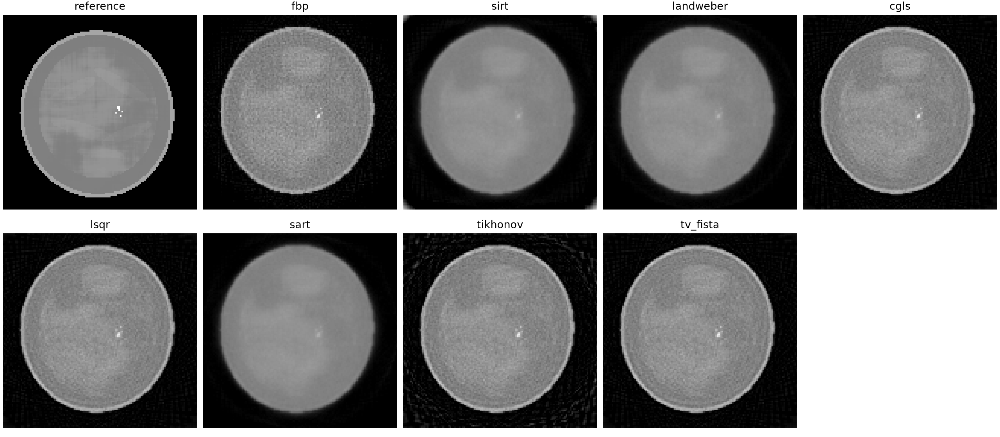
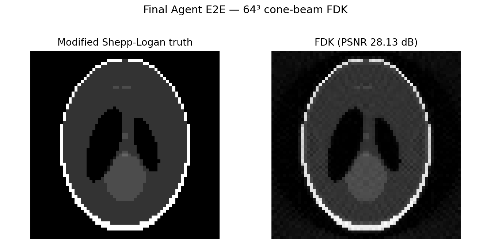

# inv_framework

`inv_framework` 是一个面向 X-ray CT 重建与评测的轻量 Python 框架。它将 CT
前向/伴随算子、经典重建算法、版本化测试数据、参数验证、收敛诊断和公平比较协议
组织为统一接口，并提供 `invct` 命令行工具。

当前版本提供 12 个 ordinary-CT solver、纯 PyTorch 2D parallel-beam Radon、ASTRA
3D/FDK 后端，以及可供上层 inverse-problem Agent 程序化读取的算法 metadata。
CT 与 USCT 是独立问题域；本仓库不包含或替代 USCT 算法。

## CT 重建模型

离散线性 CT 前向模型为：

```text
y = A x + n
```

- `x`：二维衰减图或三维体数据；
- `A`：由扫描几何确定的正投影算子；
- `y`：探测器测量；
- `n`：高斯噪声、Poisson 光子噪声或其他误差。

常见的正则化重建目标为：

```text
min_x  0.5 * ||A x - y||_2^2 + lambda * R(x)
```

算法比较必须保持投影数据、几何、预处理、分辨率、初始化、数值精度和预算协议一致。

## 支持的算法

| CLI 名称 | 算法 | 几何 | 主要配置 | 后端 |
| --- | --- | --- | --- | --- |
| `fbp` | Filtered Backprojection | 2D parallel | `scale` | PyTorch CPU/CUDA |
| `sirt` | SIRT | 2D parallel | `num_iterations`、上下界 | PyTorch CPU/CUDA |
| `landweber` | Landweber | 2D parallel | `num_iterations`、`step_size` | PyTorch CPU/CUDA |
| `cgls` | CGLS | 2D parallel | `num_iterations`、`tol` | PyTorch CPU/CUDA |
| `lsqr` | LSQR | 2D parallel | `num_iterations`、`atol`、`btol` | PyTorch CPU/CUDA |
| `sart` | SART | 2D parallel | `block_size`、`relaxation` | PyTorch CPU/CUDA |
| `os_sart` | Ordered-subsets SART | 2D parallel | `subset_count`、`relaxation` | PyTorch CPU/CUDA |
| `mlem` | MLEM | 2D parallel | `num_iterations`、`initial_value` | PyTorch CPU/CUDA |
| `osem` | OSEM | 2D parallel | `subset_count`、`initial_value` | PyTorch CPU/CUDA |
| `tikhonov` | Tikhonov CG | 2D parallel | `reg_strength`、`tolerance` | PyTorch CPU/CUDA |
| `tv_fista` | TV-FISTA | 2D parallel | `reg_strength`、TV proximal 参数 | PyTorch CPU/CUDA |
| `fdk` | Feldkamp-Davis-Kress | 3D circular cone | filter、short scan、supersampling | ASTRA CUDA |

查询 registry、默认参数和能力约束：

```bash
invct list-solvers
invct list-solvers --json
invct list-regularizers --json
```

canonical solver ID 固定为：

```text
fbp, sirt, landweber, cgls, lsqr, sart, os_sart, mlem, osem,
tikhonov, tv_fista, fdk
```

`tikhonov` 固定搭配 Tikhonov 正则，`tv_fista` 固定搭配 TV 正则。MLEM/OSEM 只接受
显式的非负 emission/count observation model；不能把 X-ray `line_integral` 或
`log_projection` 当成计数数据。FDK 要求 `cone_3d`、cubic volume、PyTorch CUDA 和
ASTRA CUDA。

## 安装

要求 Python 3.10 或更高版本。

```bash
git clone https://github.com/apricity093/agent_CT.git
cd agent_CT
python -m pip install -e ".[dev]"
```

安装后可使用控制台入口，也可使用等价的模块入口：

```bash
invct --help
python -m inv_framework --help
```

FDK 还需要安装带 CUDA 支持的
[ASTRA Toolbox](https://github.com/astra-toolbox/astra-toolbox)。二维算法可在 CPU 或
CUDA 上运行；FDK 不会回退到语义不同的 CPU 实现。

## 数据查询与校验

默认数据根目录为 `test/data`。查询 catalog：

```bash
invct data list
invct data list --dimension 2
invct data list --geometry parallel_2d --tag quality
invct data show parallel_2d/tissue_breast_dense_clean_128
```

校验 manifest、HDF5 shape 和 SHA256：

```bash
invct data validate
invct data validate parallel_2d/tissue_breast_dense_clean_128
```

外部 catalog 可通过 `--root PATH`（数据子命令）或 `--data-root PATH`（`run`）传入。
每个 case 的 HDF5 使用以下统一键：

| 路径 | 含义 |
| --- | --- |
| `truth/x` | ground truth，shape 为 `(B, *domain_shape)` |
| `measurement/y_clean` | 无噪测量 |
| `measurement/y_observed` | solver 的实际输入 |
| `masks/roi` | 可选图像 ROI |
| `masks/valid_measurement` | 可选有效测量 mask |

## 运行单个算法

每个 solver 使用自己的严格 YAML 配置。未知字段、错误类型、无效参数、几何或观测域
不兼容会在数值迭代前失败。

CPU 示例：

```bash
invct run cgls \
  --case parallel_2d/tissue_breast_dense_clean_128 \
  --config configs/algorithms/cgls.yaml \
  --out artifacts/cgls_dense_cpu \
  --device cpu
```

CUDA 示例：

```bash
invct run tv_fista \
  --case parallel_2d/tissue_breast_sparse_poisson_128 \
  --config configs/algorithms/tv_fista.yaml \
  --out artifacts/tv_fista_sparse_cuda \
  --device cuda
```

FDK 示例：

```bash
invct run fdk \
  --case cone_3d/spheres_astra_12 \
  --config configs/algorithms/fdk.yaml \
  --out artifacts/fdk_cone_cuda \
  --device cuda
```

MLEM/OSEM 必须使用明确声明 `nonnegative_counts` 或 `intensity` 的 emission catalog。
不要将上面的 transmission case 替换进统计重建命令。SART/OS-SART 的
`block_size`/`subset_count` 还必须与公开 view 数形成合法 partition。

输出目录非空时命令默认拒绝运行，防止新旧 manifest 混合。只有确认替换该次 run
产物时才显式添加 `--overwrite`。

## 离线评估

`eval` 从已保存的 tensor bundle 重算指标，不重新运行 solver，也不依赖原机器上的
projector 或 ASTRA：

```bash
invct eval \
  --run artifacts/cgls_dense_cpu \
  --protocol configs/protocols/traditional_quality.yaml
```

评估 protocol 使用显式 `{min: ...}` 或 `{max: ...}` 表示阈值方向。存在私有 ground
truth 时可报告 RMSE、PSNR、SSIM 和 relative error；Agent public staging 不向 backend
暴露 truth，此时 backend 只报告数据一致性、优化和资源指标，图像质量由独立 evaluator
计算。

## 运行 benchmark

版本化 suite 将算法配置列表与 case 列表分组，并按几何和观测模型过滤不兼容组合：

```bash
invct bench --suite configs/benchmarks/traditional_quality.yaml
```

公平比较协议可在不执行重建的情况下校验：

```bash
invct protocol-check \
  --protocol configs/fair_protocols/equal_operator_calls_v1.yaml
```

支持固定默认值、等 trial、等调参时间、等 operator calls、公共验证集，以及单独标记的
离线 oracle upper bound。在线选择不得使用测试 truth。结果按图像质量、数据一致性、
优化行为、计算效率和鲁棒性分别报告，不合成为无依据的总分。

## 在 inverse-problem Agent 中使用

本仓库可以独立运行，也可以作为
[`inverse_problem_agent`](https://github.com/zoe5xy/inverse_problem_agent) 的 CT backend。
在 Agent 项目根目录执行：

```bash
inverse-agent list-cases \
  --modality ct \
  --ct-repo external/ct-benchlab

inverse-agent list-algorithms \
  --modality ct \
  --ct-repo external/ct-benchlab

inverse-agent select-ct-candidates \
  --request request.json \
  --ct-repo external/ct-benchlab

inverse-agent validate-run \
  --request request.json \
  --ct-repo external/ct-benchlab

inverse-agent run-experiment \
  --request request.json \
  --ct-repo external/ct-benchlab
```

完整执行路径为：

```text
RunRequest
  -> Agent candidate selection and compatibility filtering
  -> Agent parameter/budget validation
  -> CTAdapter
  -> invct subprocess
  -> CT solver and diagnostics
  -> Agent convergence gate and independent evaluation
```

Agent 负责问题解释、候选选择、参数来源、尝试谱系和跨运行比较；CT backend 负责数值
合法性、solver-native 停止判据、operator-call 记账及低层诊断。达到最大迭代数或预算
耗尽不会被 Agent 改写为 `converged`。

## 输出与诊断

单次成功运行生成：

```text
run-directory/
├── reconstruction.pt
├── metrics.json
├── diagnostics.json
├── manifest.json
├── comparison.png
└── artifacts.sha256
```

`reconstruction.pt` 保存 CPU tensor bundle，便于在没有原运行 GPU 的机器上离线复评。
manifest 记录 Python、PyTorch、平台、CUDA、Git revision、dirty patch hash、输入来源、
参数和参数来源。失败运行写入结构化 failure 文件，不会从 benchmark 中静默删除。

常见 convergence status 包括：

```text
converged
completed_valid
max_iterations
stalled
diverged
operator_budget_exhausted
numerical_error
invalid_parameters
unavailable
```

直接算法在输出有限、shape 正确且参数有效时报告 `completed_valid`，不是数学意义上的
`converged`。诊断同时记录 stopping reason、objective/residual、最终残差、
forward/adjoint calls、运行时间和资源信息。

Landweber 必须满足 `0 < step_size < 2 / ||A||^2`，TV-FISTA 必须满足
`0 < step_size <= 1 / ||A||^2`。省略步长时，runtime 使用确定性 power iteration 估计
`||A||^2`，并把估计阶段的 operator calls 与 solver 迭代分开记账。

## 最终版 Agent 端到端结果

以下结果于 2026-09-02 使用最终版程序重新生成，不是直接运行 CT benchmark：

- Agent commit：`010e3a2fd0f330b292301bf227dc525d48382cb1`；
- CT commit：`28d658418c919239fd618ceb0de522207011e405`；
- 正式路径：`inverse-agent -> CTAdapter -> invct -> solver -> Agent evaluator`；
- 参数策略：固定仓库 YAML 默认值，无调参、无自动重试；
- truth policy：只允许独立 evaluator 使用，backend public staging 不含 truth；
- 2D case：`parallel_2d/tissue_breast_sparse_poisson_128`，CPU/float32；
- FDK case：`cone_3d/modified_shepp_logan_64_clean`，64³ volume、
  128×128 detector、180 views，`fno` 环境、GTX 1650、ASTRA CUDA；
- 完整紧凑证据：[artifacts/agent_final_20260902](artifacts/agent_final_20260902)。

### 2D transmission 重建

Agent 在该 case 上接纳 8 个算法。OS-SART 因默认 `subset_count=10` 与 48 views 无法形成
合法 balanced partition 而被兼容性过滤；MLEM/OSEM 属于 emission/count stratum；FDK
属于独立 3D geometry。它们没有被强行混入二维 transmission 比较。



| Solver | 状态 | 迭代/epoch | PSNR | SSIM | Runtime | Forward/Adjoint |
| --- | --- | ---: | ---: | ---: | ---: | ---: |
| FBP | `completed_valid` | 0 | 18.31 dB | 0.304 | 0.530 s | 1 / 1 |
| SIRT | `max_iterations` | 25 | 19.48 dB | 0.525 | 1.772 s | 27 / 26 |
| Landweber | `max_iterations` | 50 | 20.15 dB | 0.500 | 3.812 s | 64 / 63 |
| CGLS | `max_iterations` | 25 | 18.38 dB | 0.405 | 2.440 s | 52 / 26 |
| LSQR | `max_iterations` | 25 | 18.38 dB | 0.405 | 2.647 s | 52 / 26 |
| SART | `max_iterations` | 5 epochs | 20.12 dB | 0.558 | 3.599 s | 485 / 480 |
| Tikhonov | `max_iterations` | 100 | 17.85 dB | 0.320 | 6.083 s | 102 / 102 |
| TV-FISTA | `max_iterations` | 50 | 18.25 dB | 0.386 | 3.636 s | 60 / 59 |

这些迭代算法都完成了有限重建，但均达到固定 YAML 上限，不能写成已收敛。单个合成 case
上的 PSNR/SSIM 不能外推为普遍算法排名。

### FDK CUDA 重建

FDK 使用 `D:\anaconda3\envs\fno\python.exe`，PyTorch 2.5.1、ASTRA 2.2.0，
`astra.use_cuda() == True`。这是一次严格冻结的单次运行：modified Shepp–Logan 64³
体数据、128×128 detector、180 个等角度 views、SOD/ODD 各 320、无噪声 line-integral；
参数固定为 Ram-Lak、`short_scan=false`、`voxel_supersampling=1`，无调参、无自动重试。
backend 执行期间 truth 被隔离；下图由独立 evaluator 在运行结束后使用本次 truth 与本次
reconstruction 的中间轴向切片生成。



| Solver | 状态 | PSNR | SSIM | RMSE | Runtime | Forward/Adjoint |
| --- | --- | ---: | ---: | ---: | ---: | ---: |
| FDK | `completed_valid` | 28.13 dB | 0.825 | 0.000784 | 1.364 s | 1 / 0 |

表中 runtime 是 CT backend 原生指标；完整 Agent wall time 为 16.422 s，其中包含 case
隔离 staging、子进程启动、endpoint validation、一次 forward data-consistency 检查和独立
三维评估。FDK CUDA backend reconstruction 本身为 0.167 s。

原始结构化记录位于
[`comparison.json`](artifacts/agent_final_20260902/comparison.json)，冻结协议位于
[`protocol.json`](artifacts/agent_final_20260902/protocol.json)，文件摘要位于
[`checksums.sha256`](artifacts/agent_final_20260902/checksums.sha256)。FDK 的精简 Agent
结果与正式请求分别见
[`fdk_agent64_result.json`](artifacts/agent_final_20260902/fdk_agent64_result.json) 和
[`request_fdk.json`](artifacts/agent_final_20260902/request_fdk.json)。

## Python API

CLI 与 Python API 使用相同的 case 和 operator：

```python
import torch

from inv_framework.benchmarks import load_ct_case
from inv_framework.operators.ct import ParallelBeamRadon2D
from inv_framework.solvers import CGLSSolver

device = "cuda" if torch.cuda.is_available() else "cpu"
case = load_ct_case(
    "parallel_2d/tissue_breast_dense_clean_128",
    device=device,
)
angles = torch.tensor(case.geometry["angles_rad"], device=device)
operator = ParallelBeamRadon2D(
    image_size=case.truth.shape[-1],
    angles=angles,
    device=device,
)
solver = CGLSSolver(num_iterations=25, min_value=0.0, max_value=0.02)
reconstruction = solver.solve(case.measurement, operator)
```

自定义线性 CT 算子需要实现 `LinearOperator.forward()` 与
`LinearOperator.adjoint()`；自定义 solver 应实现
`InverseProblemSolver.solve(y, operator, **kwargs)`。

## 项目结构

```text
agent_CT/
├── inv_framework/
│   ├── cli.py                 # invct 命令解析
│   ├── ct_runtime.py          # registry、run、eval、bench
│   ├── benchmarks/            # 版本化 case API
│   ├── operators/             # forward / adjoint / CT operators
│   ├── solvers/               # 经典、子集、统计与正则化算法
│   ├── regularizers/          # Tikhonov、TV
│   └── utils/                 # PSNR、SSIM
├── configs/
│   ├── algorithms/            # solver YAML
│   ├── benchmarks/            # benchmark suite
│   ├── fair_protocols/        # 公平比较协议
│   └── protocols/             # 评估阈值
├── test/                      # CT runtime 与集成测试
├── tests/                     # 算子和既有回归测试
├── examples/
├── tools/
├── artifacts/                 # 版本化示例和紧凑证据
└── pyproject.toml
```

## 开发与测试

运行全部测试：

```bash
python -m pytest -q test tests
```

运行 CLI、registry、参数和收敛相关的快速验证：

```bash
python -m pytest -q \
  test/test_invct_cli.py \
  test/test_registry_diagnostics.py \
  test/test_batch6_parameter_validation.py \
  test/test_convergence_protocol.py
```

验证公平协议和紧凑 benchmark 证据：

```bash
python -m pytest -q \
  test/test_batch10_fair_protocols.py \
  test/test_batch13_budgeted_benchmark.py
```

小规模代码验证与完整 CT benchmark 应分开执行。修改 forward/adjoint operator 时还应
执行数值伴随一致性检查：

```text
<A x, y> approximately equals <x, A* y>
```

## 能力边界与数据许可

- `ASTRAFDKOperator3D` 只接受 ASTRA regular circular `cone` geometry 和 cubic voxels；
- `parallel3d`、任意 `cone_vec` 和非等边体素不会被伪装成已支持；
- ASTRA FDK 使用官方 `FDK_CUDA`，支持 Ram-Lak、Parker short-scan weighting 和
  voxel supersampling；
- 128×128 tissue case 和 32×32 Shepp-Logan case 是确定性合成 phantom，不是患者数据；
- 大型或受许可约束的数据集只登记在 `test/data/external_catalog.json`，不会自动下载。

外部数据与可选后端：

- [2DeteCT](https://zenodo.org/records/6802615)：CC BY 4.0；
- [FIPS Walnut CT](https://fips.fi/dataset.php)：使用时遵守数据集条款；
- [ASTRA Toolbox](https://github.com/astra-toolbox/astra-toolbox)：GPL-3.0；
- [LLNL LEAP](https://github.com/LLNL/LEAP)：MIT。

## 许可证

项目元数据声明为 MIT。外部后端和数据集保持各自许可证与使用条款。
